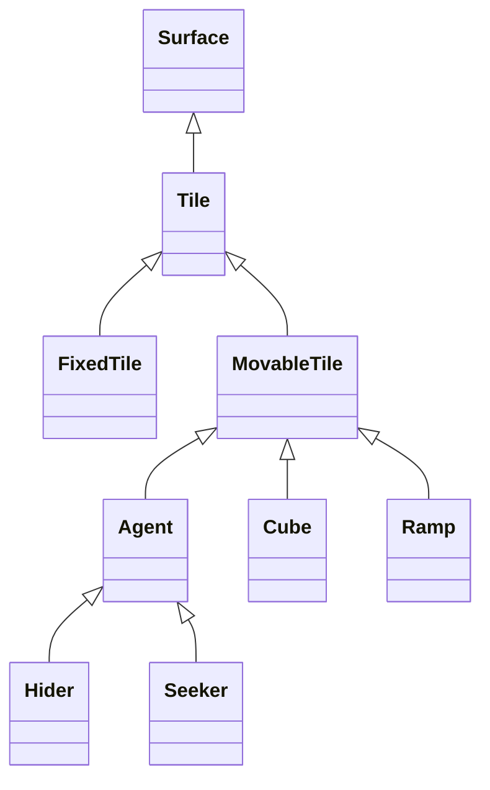

# Overview

The purpose of the *hide-and-seek* C++ program is first to bring entertainment through a simple game, and to explore what an artificial model is capable to learn from this game. In the first part of this project, a [previous Python version](https://github.com/chinchay/hide-and-seek) of this game has been largerly simplified and optimized using C++, but still conserving the same game logic. This 2-dimensional game is inspired on the [OpenAI research work](https://openai.com/research/emergent-tool-use) where hiders and seekers compete to find new strategies and adapt to new sitations, which will the focus of the second part of this ongoing project. The game begins with *sleeping* seekers, giving hiders the opportunity to rearrange digital objects in their favor. As soon as seekers wake up, they begin to look for the hiders and can create new strategies to find them. During the game, agents cannot see through objects, like blocks or walls, so each player will see black areas rendered on the screen depending on the agent's position. The game ends when a hider is in the seeker's range of vision or when the seeker cannot find the hider after a certain time.


# How it works

This game version has been written in C++ using an oriented object approach, and heavely relies on the use of pointers, abstract classes and inheritance. Special care has been taken to optimize loop operations and reduce the number of costly mathematical operations. This version had to be built to attend the pre-requisite of having a very fast scenary to run the millions of game runs needed to train a reinforcement learning model. As a referece, it can perform 100,000 moves using 50 movable blocks in a Mac equipped with a 1.6 GHz Dual-Core Intel Core i5 processor in less than 0.3 seconds. 

This code creates a platform game by using icons (or *tile* in the code) to build walls, movable blocks, and *agents*. An agent can be of type *seeker* or *hider*, and they respond to keyboard events. An agent cannot see through the walls or blocks, so a seeker will need to move ramps to see at the other side of the wall, and hiders will need to use blocks smartly. For this C++ game version, all these features have been implemented and is ready for the second part involving AI training. This C++ game has been compiled as a shared library ready to be used for another C++ or Python code in which a reinforcement learning model will be built.




A demonstration of the software running and a walkthrough of the code can be found [here]().


# How to use it

Assuming C++ is installed on your machine, clone this repository

```console
$ git clone https://github.com/chinchay/hide-and-seek-AI.git
```


and install it

```console
$ cd hide-and-seek-AI
$ make
```

To be used as a compiled shared library, follow these steps:


Seeker will respond to keys 0; (up move),  1; (down move), 2; (left move),  3; (right move), while hider will respond to 5 (up move), 6 (down move), 7 (left move), and 8 (right move). An additional move has been equipped to the seeker: `9` will allow him to jump on the ramp and go through it and all other obstacles until finding an empty place, allowing him to enter into a closed fortress. It is required that both hider and seeker to be played in the same machine, as it would serve to train an AI model.


# Development Environment

* __Editor__: Visual Studio Code
* __Language__: C++
* __Version control system__: Git
* __Cloud repository__: GitHub


# Useful Websites


__Buiding a map of tiles from file__
* [Machine learning is fun](https://medium.com/@ageitgey/machine-learning-is-fun-part-2-a26a10b68df3)

__For future development__


# Future work
* Implement the reinforcement learning model


# Copyright and license

Code released under the MIT License


# hide-and-seek-AI
Artificial intelligent agents will be playing the hide-and-seek game


https://stackoverflow.com/questions/8848575/fastest-way-to-reset-every-value-of-stdvectorint-to-0
https://www.matecdev.com/posts/cpp-call-from-python.html#:~:text=There%20are%20basically%20two%20ways,%2Dlevel%20C%2Dstyle%20solution.
https://www.youtube.com/watch?v=H2wOlriHGmM&ab_channel=FacileTutorials


https://www.learndatasci.com/tutorials/reinforcement-q-learning-scratch-python-openai-gym/